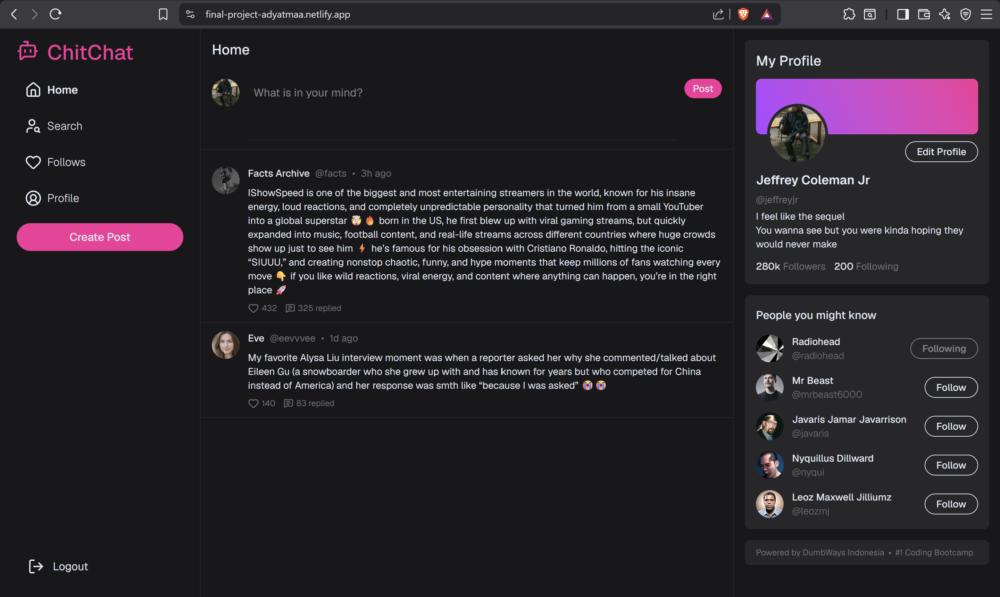

# 🖥️ Final Project - Social Media Website

This is a bootcamp final project, that show a dummy social media pages using HTML, Tailwind CSS and Javascript.



Or, you can preview the site [here](https://final-project-adyatmaa.netlify.app/)

## Key Features

This social media site called ChitChat, uses local storage to store the content that just posted by user.

## Tech Stack

- [Tailwind CSS](https://tailwindcss.com/) for the UI
- [Netlify](https://app.netlify.com) for deployment

## How to run this on your local computer

Firstly, clone this repo

```bash
git clone https://github.com/adyatmaa/final-project-dumbways.git
```

Then, install the dependencies and run the code with

```bash
npm install
npm run dev
```

All set, you can run this code locally in your computer👌
